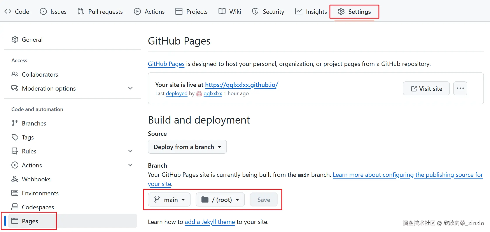
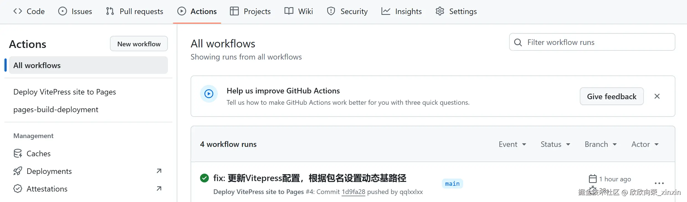

## 1. 新建一个 VitePress 项目，如 docs

[VitePress 中文文档 - v1.5.0](https://vitepress.dev/zh/guide/getting-started)

初始化仓库：进入到仓库并按顺序执行以下命令

```bash
npm init

npm add -D vitepress

npx vitepress init
```

文件结构如下

```arduino
├─ docs
│ ├─ .vitepress
│ │ └─ config.js // 配置文件
│ ├─ public // 这里可以放入全局文件内容，打包后原样复制到 dist
│ ├─ api-examples.md
│ ├─ markdown-examples.md
│ └─ index.md
└─ package.json
```

启动并运行

```bash
bash npm run docs:dev
```

## 2. gitgub 准备

1. 在 github 上创建一个仓库，如 docs

2. 在 settings/pages 中更换设置



## 上传到 gitgub 并自动部署

1. 在项目下创建一个 .github/workflows/deploy.yml 文件，内容可根据自己情况调整，包含内容如下

```yaml
# 构建 VitePress 站点并将其部署到 GitHub Pages 的示例工作流程
#
name: Deploy VitePress site to Pages

on:
  # 在针对 `main` 分支的推送上运行。如果你
  # 使用 `master` 分支作为默认分支，请将其更改为 `master`
  push:
    branches: [main]

  # 允许你从 Actions 选项卡手动运行此工作流程
  workflow_dispatch:

# 设置 GITHUB_TOKEN 的权限，以允许部署到 GitHub Pages
permissions:
  contents: read
  pages: write
  id-token: write

# 只允许同时进行一次部署，跳过正在运行和最新队列之间的运行队列
# 但是，不要取消正在进行的运行，因为我们希望允许这些生产部署完成
concurrency:
  group: pages
  cancel-in-progress: false

jobs:
  # 构建工作
  build:
    runs-on: ubuntu-latest
    steps:
      - name: Checkout
        uses: actions/checkout@v4
        with:
          fetch-depth: 0 # 如果未启用 lastUpdated，则不需要
      # - uses: pnpm/action-setup@v3 # 如果使用 pnpm，请取消此区域注释
      #   with:
      #     version: 9
      # - uses: oven-sh/setup-bun@v1 # 如果使用 Bun，请取消注释
      - name: Setup Node
        uses: actions/setup-node@v4
        with:
          node-version: 20
          cache: npm # 或 pnpm / yarn
      - name: Setup Pages
        uses: actions/configure-pages@v4
      - name: Install dependencies
        run: npm ci # 或 pnpm install / yarn install / bun install
      - name: Build with VitePress
        run: npm run docs:build # 或 pnpm docs:build / yarn docs:build / bun run docs:build
      - name: Upload artifact
        uses: actions/upload-pages-artifact@v3
        with:
          path: docs/.vitepress/dist

  # 部署工作
  deploy:
    environment:
      name: github-pages
      url: ${{ steps.deployment.outputs.page_url }}
    needs: build
    runs-on: ubuntu-latest
    name: Deploy
    steps:
      - name: Deploy to GitHub Pages
        id: deployment
        uses: actions/deploy-pages@v4
```

2.  上传到 gitgub 中，就会自己执行 actions


